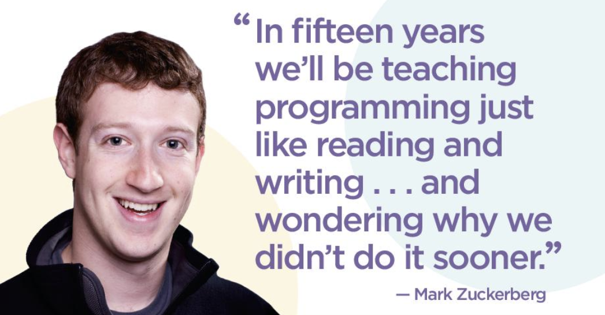

<!-- .slide: data-background="media/img/jobsimulator-blur.jpg" -->

Ciência da Computação & Informática Biomédica

  <h1>Mercado de Trabalho</h1>
  
  

    <a href="https://twitter.com/tiagovignatti">@tiagovignatti</a> | <a href="https://www.imersys.com">Imersys</a> | ex-Intel, ex-Nokia, ex-UFPR
  

<!-- NOTES -->
- Onboard web developers into the 3D and VR world with easy-to-use tools
- Prototype WebVR experiences faster

------

# 2001

<!-- .slide: data-background="media/img/windowsxp.png" -->

<!-- NOTES -->

---

  

  

  

  

  

  

---

## Qual era a motivação?

---

## Qual era a motivação? Games

<!-- .slide: data-background="media/img/gta1.jpg" -->

---

## Qual era a motivação? Money

<!-- .slide: data-background="media/img/.jpg" -->

  <i>"informática é o futuro e parece que dá dinheiro"</i>

---

## Qual era a motivação? Estudo

<!-- .slide: data-background="media/img/" -->

  <i>"gosto de matemática; quero ser pesquisador"</i>

---

## Qual era a motivação? Corporação

<!-- .slide: data-background="media/img/" -->

  <i>"tenho vontade de trabalhar numa empresa multinacional de tecnologia"</i>

---

## Qual é a motivação <b>agora</b>?

---

## Qual é a motivação agora?

  <i>"Prefiro empreender ao invés de ter um emprego estável"</i>

---

## Qual é a motivação agora?

  <i>"não gosto de pessoas; prefiro interagir com máquinas"</i>

---

## Qual é a motivação <b>agora</b>?

  <i>?</i>

------
<!-- .slide: data-background="media/img/trote_usp.jpg" -->

# 2002 - 2009

---

## Primeira semana de aula...

---

## Primeira semana de aula... eu não sabia programar!

  
<i>"quantas linguagens de programação vc sabe?"</i>

  
<i>"eu programo o código do Doom" (!)</i>

---

## Primeiros 12 meses...

---
<h2 style="text-align: left">Primeiros 12 meses...</h2>
&nbsp;

  

    
 • Universidade é uma festa! Right...

    
 • Reprovações em disciplinas

    
 • Ansiedade por um trabalho "de verdade"

    
 • "Envolvimento" acadêmico

  

---

<!-- .slide: data-background="media/img/minecraft-blocks.png" -->

## ... e então as coisas foram se ajustando

---

## ... e então as coisas foram se ajustando

  

    
 • Bolsas de estudo

    
 • Disciplina rígida e insatisfação permanente

    
 • Investimento em escrita e comunicação

    
 &emsp; &#9702; 2001: Enem e vestibular: piores notas em redação

    
 &emsp; &#9702; 2006: Blog técnico em inglês (<a href="www.vignatti.com">www.vignatti.com</a>)

    
 • Trabalho / estudos a distância, flexibilidade de horário, bicicleta

  

---
<!-- .slide: data-background="media/img/aframe.jpg" data-transition="fade-in slide-out" -->

<h2 style="text-align: left">Bolsas de estudo ("estágio")</h2>

  
 • 2004: C3SL

  
 • 2005: Iniciação Científica

  
 • 2007: Mestrado (bolsista)

  
 • 2007: Google Summer of Code

  
 • 2008: Google Summer of Code

---

<h2 style="text-align: left"> Bolsas de estudo ("estágio")</h2>
&nbsp;

  
 • Software livre: olhar, explorar e contribuir

  
 • Professores entendem: liberdade, day-off, provas

  
 • Enquanto está aprendendo, tá valendo!

---

<h2 style="text-align: left">Mestrado</h2>
&nbsp;

  
 • Forma de adiar minha decisão profissional

  
 • Demorei 6 meses a mais para me formar

---

<!-- .slide: data-background="media/img/grad.jpg" -->
<h2 style="text-align: left"> ...final do Mestrado</h2>
&nbsp;

  
 • Envio de CV para o mundo inteiro

  
 • Crise econômica mundial de 2009...

---
<!-- .slide: data-background="media/img/bomb.jpg" -->

---

## Sorte

  

    
    <i>Linux ❤ Android </i>
  

  

    
    <i>Nokia</i>
  

  

    
    <i>Finlândia</i>
  

------

<!-- .slide: data-background-video="media/video/virtualreality.mp4" data-background-video-loop="true" data-background-video-muted="true" data-state="state--bg-dark" -->

# 2009 - 20??

---

  

  

  

  
  

  

  

---

------

<!-- .slide: data-background="media/img/metaverse.jpg" -->

# Palavras Finais

---

### Palavras Finais

  
 • Ideias originais têm desdobramentos completamente diferentes de suas concepções

  
 • Desconexão total com o mundo profissional

    
 &emsp; &#9702; Graduação: teoria da computação

    
 &emsp; &#9702; Mestrado: sistemas distribuídos e redes

    
 &emsp; &#9702; Hobby sério #1: banda de pop / rock / progressivo

    
 &emsp; &#9702; Hobby sério #2: desenvolvimento de software livre

  
 • ser perdido é okay, mudar de área é okay

---

<h3 style="text-align: left">A insatisfação permanente é algo importante</h3>
&nbsp;

  
 • inovação sem medo

  
 • persistência

  
 • muita curiosidade

  
 • pense no que te faz feliz

---

  <i>“É mais importante aprender a falar inglês do que se formar no curso de computação”</i>, <a href="https://twitter.com/tmpsantos">@tmpsantos</a>, Engineer Manager Mapbox

---

<!-- .slide: data-background-video="media/video/boilerplate.mp4" data-state="state--bg-dark" -->

  

<i>“85% das profissões que existirão em 2030 ainda não foram criadas; as outras 15% restantes serão chatas”</i>, Igor Sales, CEO Imersys

---

---

---

<h2 style="text-align: left">Obrigado!</h2>
&nbsp;

  
 (aberto para discussões)

&nbsp;

  
<a href="https://twitter.com/tiagovignatti">@tiagovignatti</a>

  
https://github.com/tiagovignatti/aframe-presentation-kit/

---

## A-Frame

<!-- .slide: data-background="media/img/inspector.png" data-state="state--bg-dark" -->

Just `<ctrl>+<alt>+i`.

------

<!-- .slide: data-background="media/img/header.png" -->

# A-Frame community

https://aframe.io/blog/

---

<!-- .slide: data-background="media/img/apainter.gif" -->

# Art - *A-Painter*

@mozillavr

---

<!-- .slide: data-background="media/img/syria.gif" -->

# Journalism - *Fear of the Sky*

Amnesty International UK

---

<!-- .slide: data-background="media/img/mars.jpg" -->

# Journalism - *Journey to Mars*

The Washington Post

---

<!-- .slide: data-background="media/img/citybuilder.gif" -->

# Sandbox - *City Builder*

@kfarr

---

<!-- .slide: data-background="media/img/adit.gif" -->

# Data Visualization - *Adit*

@datatitian

---

<!-- .slide: data-background="media/img/a-blast.gif" -->

# Gaming - *A-Blast*

@mozillavr

---

<!-- .slide: data-background="media/img/ux.gif" -->

# Prototyping - *UI Widgets*

@whoyee

---

<!-- .slide: data-background="media/img/math.gif" -->

# Mathematics - *MathworldVR*

@sleighdogs

---

<!-- .slide: data-background="media/img/ar.gif" -->

# AR - *AR.js + A-Frame*

@jerome_etienne

---

<!-- .slide: data-background="media/img/webvrstudio.png" -->

# Tools - *WebVR Studio*

@webvrstudio

---

<!-- .slide: data-background-video="media/video/livetour.mp4" data-background-video-loop="true" -->

# Real Estate - *Live Tour*

iStaging

---

<!-- .slide: data-background="media/img/cadavr.gif" -->

# Education - *CadaVR*

@drryanjames

---

# aframe.io

  

    
    <i>180+ contributors 6000+ Stargazers</i>
  

  

    
    <i>4000+ members on Slack</i>
  

  

    
    <i>100s of featured projects</i>
  

<!-- NOTES -->
- Open source and inclusive project
- Most work done on GitHub
- Active community on Slack to share projects, interact, hang out, seek help
- Featured projects on the `awesome-aframe` repository and *A Week of A-Frame* blog
